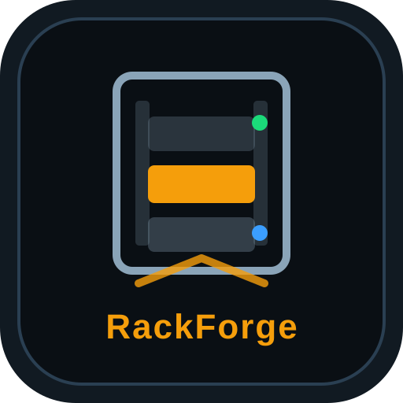

<p align="center">
  
</p>

<h1 align="center">RackForge</h1>
<p align="center"><strong>Plan, build, and manage your server racks — self-hosted, zero external dependencies.</strong></p>

<p align="center">
  
  
  
  
</p>

---

## About

Planning where physical equipment goes in a rack is normally done in a spreadsheet, a diagram
tool, or in someone's head. RackForge replaces that with a purpose-built planner: drag equipment
onto a virtual rack, and it tracks U-space and power draw for you as you go, so you know before
you touch a screwdriver whether a device actually fits and whether the rack's power budget still
holds up.

It's built for anyone who manages physical racks and wants a shared, always-up-to-date source of
truth instead of a stale diagram — homelab owners, small IT teams, and MSPs managing racks for
multiple clients. Accounts can own several racks, share a rack with a colleague as a viewer or
editor, and every change is automatically snapshotted so a bad edit is one click away from being
undone.

The whole thing is one Python process (standard library only — no pip/npm dependency tree to
audit or break) backed by SQLite, fronted by Caddy for TLS and static file serving, with an
admin panel for managing users, sessions, and licensing built in. That means it runs on
practically anything with Python 3 installed: a Docker container, a bare LXC, a spare laptop —
no database server, no build step, no external services required to get it running.

## Features

- **Rack planning** — drag-and-drop equipment placement, U-space and power-budget tracking, custom equipment types
- **Multi-rack accounts** — save, switch between, and manage multiple racks per user
- **Version history** — automatic snapshots with one-click restore
- **Shared racks** — invite collaborators as viewer or editor
- **Export** — PNG and PDF rack diagrams
- **Admin panel** — user/session management, audit log, license management, CSV/JSON exports
- **Accounts** — email/password and Google OAuth, email verification, password reset
- **i18n** — Dutch and English out of the box

## Tiers

RackForge ships as one codebase with tier-gated limits, unlocked by a signed license key
(entered under **Admin → License**, no restart required):

| | Community | Pro | Enterprise |
|---|---|---|---|
| Racks per user | 1 | 5 | Unlimited |
| Custom equipment types | — | 10 | Unlimited |
| Version history | 3 snapshots | 20 snapshots | 100 snapshots |
| Shared collaborators per rack | — | 3 | Unlimited |
| Admin audit log | — | ✓ | ✓ |

The Community tier requires no license key and runs fully self-hosted, free.

## Installation

Two supported paths, pick whichever fits your setup:

- **[Docker](#quick-start-docker)** — the fastest way to get RackForge running on any Linux
  host or LXC that has Docker installed. Everything (API + Caddy + TLS) is containerized;
  updating means `git pull` + `docker compose up -d --build`. Recommended for most people.
- **[Bare-metal on Ubuntu](#bare-metal-install-ubuntu--caddy)** — installs directly onto the
  host as a systemd user service behind a system-installed Caddy. No Docker required, but you
  manage Caddy, systemd, and TLS certificates yourself.

Both paths end up in the same place: a running API on port 8080, a Caddy reverse proxy handling
`/api/*` and `/admin/*`, and a bootstrap `admin` account you log into to configure everything
else (license key, SMTP, Google OAuth) from the admin panel — no config file editing needed
after the initial setup.

## Quick start (Docker)

Requires Docker + the Compose plugin (`docker compose version`) on the target host.

```bash
git clone https://github.com/stefpeerlings/rackforge.git
cd rackforge
cp .env.example .env                              # set DOMAIN
cp api/rackforge.env.example api/rackforge.env     # set RACKFORGE_ADMIN_PASSWORD
docker compose up -d --build
```

`.env` controls the public-facing domain Caddy serves on; `api/rackforge.env` holds the app's
own secrets (admin password, and optionally SMTP/Google OAuth/license key — see the comments in
the example file for each). Neither file is committed to git.

This starts two containers:

- **`api`** — the Python API (zero pip dependencies; only the `openssl` CLI is added, for
  license-key verification), with a named volume for `plans.db` and avatars.
- **`web`** — Caddy with the static site baked in. Automatically requests a Let's Encrypt
  certificate for `DOMAIN` (or plain HTTP if `DOMAIN=localhost`, for local/LAN testing — also
  set `RACKFORGE_SECURE_COOKIE=0` in `api/rackforge.env` in that case, see the example file).

Log in at `/admin` (user **`admin`**, password from `rackforge.env`) to paste a license key
under **License** — it takes effect immediately, no restart needed.
`api/issue_license.py` (the vendor-only key-signing tool) is deliberately excluded from the image.

Note that `/admin` (the operator panel) and the planner itself are separate account systems:
visit `/main` and sign up for a regular account to actually start planning racks — the `admin`
login is only for managing the instance (users, sessions, audit log, license).

Rebuild after a `git pull`:

```bash
docker compose up -d --build
```

## Bare-metal install (Ubuntu + Caddy)

```bash
git clone https://github.com/stefpeerlings/rackforge.git rackforge-src && cd rackforge-src && bash install.sh
```

That's it — clone and full restore in one line.

> **Note:** clone into a directory name other than `rackforge` (e.g. `rackforge-src` as above).
> `API_DIR` defaults to `~/rackforge` (see `rackforge-api.user.service`), so a checkout in that
> exact directory collides with the restore step.

The script:

1. Installs Caddy via its official apt repo, if not already present (set `INSTALL_CADDY=0` to
   skip and manage it yourself)
2. Copies the static site to `/var/www/html` (if writable)
3. Places the API files in `~/rackforge`
4. Creates config templates in `~/.config/rackforge/`
5. Starts the `rackforge-api` user service
6. Copies a ready-to-use `Caddyfile.new` into your home directory

Caddy is installed but not auto-configured — copy `Caddyfile.new` into `/etc/caddy/Caddyfile`
(fill in your own domain/IP, see below) and reload it once you've filled that in.

### Configuration

Copy the `.example` files and fill in secrets:

| File | Purpose |
|---|---|
| `~/.config/rackforge/admin.env` | Admin password (`RACKFORGE_ADMIN_PASSWORD`) |
| `~/.config/rackforge/smtp.env` | Email (password reset, verification) |
| `~/.config/rackforge/google.env` | Google OAuth (optional) |

Templates live in `api/*.env.example`.

Bootstrap admin: username **`admin`** with the password from `admin.env` (Owner role) — this logs
into `/admin`, the operator panel (users, sessions, audit log, license), which is separate from
regular planner accounts. Visit `/main` and sign up normally to start planning racks.

### Database

The SQLite database (`plans.db`) is **not** in git. To migrate, copy it manually:

```bash
scp user@old-server:~/rackforge/plans.db ~/rackforge/plans.db
systemctl --user restart rackforge-api
```

### Requirements

- Ubuntu server (Caddy is installed automatically by `install.sh` if missing)
- Python 3
- systemd (user service for the API)

## Deploying to your own infrastructure

The deploy/ops scripts in the repo root and `scripts/` (Caddy, DNS, Cloudflare Tunnel, Windows
deploy) read your server details from a local, never-committed config file instead of having
them hardcoded:

```bash
cp deploy.local.sh.example deploy.local.sh     # Linux/macOS — fill in, then: source deploy.local.sh
cp deploy.local.ps1.example deploy.local.ps1   # Windows — fill in
```

See the `.example` files for available variables (`DEPLOY_HOST`, `DEPLOY_DOMAIN`, `LAN_CIDR`,
`CF_TUNNEL_ID`, …).

### Deploy from Windows

```powershell
cd C:\path\to\rackforge
.\deploy.ps1
```

Deploys the site + API to the server from `deploy.local.ps1` (`DEPLOY_HOST`) and restarts the API.

One-time server setup:

```bash
bash setup-server.sh    # /var/www/html permissions, passwordless Caddy sudo
bash setup-api.sh       # alternative: system-wide API service
```

### Caddy

`/api/*` and `/admin/*` are reverse-proxied to the API on port **8080**. Static pages are served
from `/var/www/html`.

After a config change:

```bash
sudo cp ~/Caddyfile.new /etc/caddy/Caddyfile
sudo systemctl reload caddy
```

### Useful commands

```bash
# API status
systemctl --user status rackforge-api
journalctl --user -u rackforge-api -f

# Health check
curl http://127.0.0.1:8080/api/health
```

## Project structure

```
├── api/                  # Python API + admin panel
│   ├── server.py
│   ├── admin_panel.py
│   ├── license.py        # Tier/license verification
│   └── *.env.example
├── css/ js/ icons/       # Frontend assets
├── *.html                # Pages
├── Caddyfile             # Reverse proxy (/api, /admin -> :8080), bare-metal
├── docker/Caddyfile      # Reverse proxy, Docker
├── docker-compose.yml    # Docker deploy
├── deploy.ps1            # Windows deploy
├── rackforge-api.user.service
├── install.sh            # Entry point (calls the restore script)
└── scripts/
    └── restore-ubuntu.sh # Restore onto a fresh server
```

## Contributing

Issues and pull requests are welcome. Please don't commit `.env` files, `plans.db`, avatars,
passwords, or `deploy.local.sh`/`deploy.local.ps1` — see `.gitignore`.
